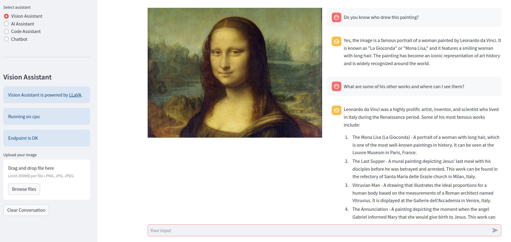

# ai-assistant

## 🔧 Getting Started

You will need to set up your development environment using conda, which you can install [directly](https://docs.conda.io/projects/conda/en/latest/user-guide/install/index.html).

```bash
conda env create --name assistant python=3.11
conda activate assistant
pip install -r requirements.txt
```

### Tracing

We shall use [Phoenix](https://docs.arize.com/phoenix) for LLM tracing. Phoenix is an open-source observability library designed for experimentation, evaluation, and troubleshooting. Before running the app, start a phoenix server

```bash
python3 -m phoenix.server.main serve
```


## 💻 Vision Assistant App

Download `ggml-model` and `mmprog-model` from [mys/ggml_llava-v1.5-7b](https://huggingface.co/mys/ggml_llava-v1.5-7b) and save them in `models/llava-7b/`. Update `CLIP_MODEL_PATH` and `LLAVA_MODEL_PATH` in `config.yaml` accordingly.

Deploy LLAvA model as an endpoint.
```bash
python -m serve_llava
```

Run Streamlit app and select `Vision Assistant`.
```bash
streamlit run app.py
```




## 💻 ReAct Agent App

This app demostrates using agent to implement the ReAct logic. We shall use tools like Tavily, Wikipedia, News API and Wolfram Alpha. The LLM is Gemini-Pro. The following API keys are required:
- Google: `GOOGLE_API_KEY`
- Tavily: `TAVILY_API_KEY`
- News API: `NEWSAPI_API_KEY`
- Wolfram Alpha: `WOLFRAM_ALPHA_APPID`
Save these keys in `.env`.

Run Streamlit app and select `ReAct Agent`.
```bash
streamlit run app.py
```
